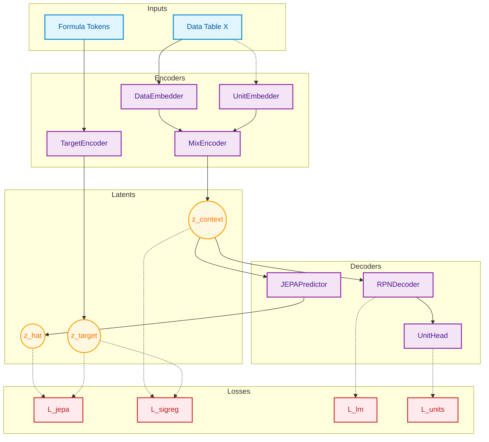

# LLM-JEPA Architecture & Pipeline Overview

This document describes the high-level architecture and data flow of the LLM-JEPA Symbolic Regression system. For detailed explanations of individual files, see the [modules/](modules/) subfolder.

---

## Goal

Given a table of numerical observations `(X, y)`, discover the symbolic mathematical equation `f` such that `y = f(X)`. The model learns to map raw data directly to formulas expressed in Reverse Polish Notation (RPN).

---

## High-Level Pipeline

### Training

### Inference (Simplified)

At inference time, the Target Encoder, Predictor, and UnitPredictionHead are all **discarded**. Only the encoding → decoding path is used:

The decoder generates tokens autoregressively with a validity mask that enforces correct RPN grammar at every step.

---

## Core Concepts

### 1. IEEE-754 Bit Encoding
Instead of feeding raw floats into the model, each scalar value is converted to its 16-bit IEEE-754 binary representation. This gives the model a universal, lossless view of numerical data regardless of scale or magnitude.

### 2. Reverse Polish Notation (RPN)
Formulas are expressed in postfix notation (e.g., `x1 x2 + sin`). This eliminates parentheses entirely and enables grammar-constrained generation using a simple stack counter — if the stack depth is wrong, certain tokens are masked out before softmax.

### 3. Joint Embedding Predictive Architecture (JEPA)
The model learns in a shared latent space. The **Context Encoder** (MixEncoder) compresses data tables into `z_context`, while the **Target Encoder** compresses ground-truth RPN formulas into `z_target`. A small **Predictor** learns to map `z_context → z_hat ≈ z_target`. This forces the encoder to extract semantically meaningful features from raw data.

### 4. SIGReg (Sketched Isotropic Gaussian Regularization)
Instead of using Exponential Moving Average (EMA) to prevent representation collapse, this project uses **SIGReg** from LeJEPA. It constrains the embedding distributions to be isotropic Gaussian, allowing both encoders to be fully trainable with gradient flow.

### 5. Physical Unit Awareness
Every variable carries a 5-dimensional unit signature `[m, s, kg, K, V]` (SI base units). The **UnitEmbedder** injects this information into the encoder, and the **UnitPredictionHead** teaches the decoder's hidden states to linearly encode dimensional structure. This is a training scaffold discarded at inference.

---

## Data Flow Summary

| Stage | Input | Output | Module |
|-------|-------|--------|--------|
| Embed data | `X_bits [B,N,V,16]` | `[B,N,V,d]` | `DataEmbedder` |
| Embed units | `unit_idx [B,V,5]` | `[B,V,d]` | `UnitEmbedder` |
| Encode data | fused embeddings | `z_context [B,d]`, `var_summaries [B,V,d]` | `MixEncoder` |
| Encode formula | `token_ids [B,T]` | `z_target [B,d]` | `TargetEncoder` |
| Predict target | `z_context`, `var_summaries` | `z_hat [B,d]` | `JEPAPredictor` |
| Decode formula | `z_context`, `token_ids` | `logits [B,T,vocab]` | `RPNDecoder` |
| Predict units | `h_states [B,T,d]` | `5 × [B,T,9]` | `UnitPredictionHead` |

